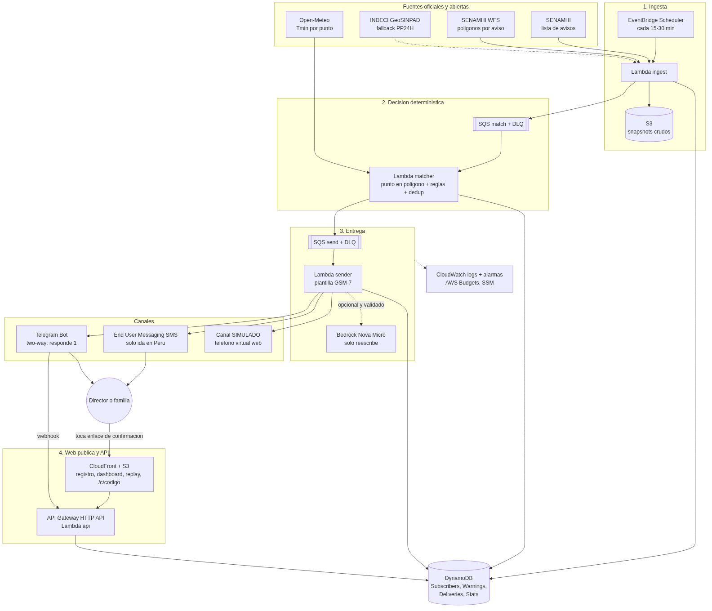

# Aviso Andino

**El aviso oficial de SENAMHI, a tiempo, en un SMS claro, para el colegio rural que lo necesita.**

- 🌐 URL pública: `https://d2p62exvpg7lbb.cloudfront.net`
- 🎥 Video (2–3 min): `<pendiente>`
- 🧭 Arquitectura: [`docs/ARCHITECTURE.md`](docs/ARCHITECTURE.md) · 

---

## El problema
- SENAMHI emite avisos meteorológicos por niveles (AMARILLO, NARANJA, ROJO) con polígonos exactos. Ejemplo: el **Aviso N.° 388 (28-sep-2026, NARANJA)** prevé "valores próximos a los −17 °C en zonas por encima de los 4000 m s. n. m. en la sierra sur" para el 2-oct ([lista de avisos SENAMHI](https://www.senamhi.gob.pe/?p=aviso-meteorologico)).
- Esos avisos viven en páginas web, mapas y PDFs. **Una directora de un colegio rural con un celular básico y 2G no los ve a tiempo.**
- El Estado reconoce el riesgo: el **Plan Multisectorial ante Heladas y Friaje 2025-2027** se actualizó para 2026 con distritos focalizados ([DS 083-2026-PCM](https://www.gob.pe/institucion/pcm/normas-legales/8207321-083-2026-pcm), [El Peruano](https://elperuano.pe/noticia/296876-gobierno-actualiza-plan-contra-heladas-revise-los-distritos-priorizados-para-2026)), y sus criterios priorizan **locales educativos** de inicial y primaria con susceptibilidad alta o muy alta a heladas y friaje ([criterios PMHF](https://cdn.www.gob.pe/uploads/document/file/9690853/7930546-anexo-n-1-criterios-de-priorizacion-consolidado-f.pdf)).
- Escala: **63 562 colegios rurales activos** en el padrón MINEDU ESCALE (conteo propio vía [GeoSINPAD](https://geosinpad.indeci.gob.pe/indeci/rest/services/SIRAIM/SDE_IE_ESCALE_MINEDU/MapServer/0)).
- *(Pendiente: añadir cifras de impacto en salud y educación de INEI o CENEPRED **solo con enlace verificado**.)*

## Cómo funciona (en palabras simples)
1. **Te registras** con tu celular: buscas tu colegio o pones un pin en el mapa.
2. **Cada 15 minutos** revisamos los avisos oficiales de SENAMHI (y los de INDECI como respaldo).
3. Si tu punto cae **dentro de la zona NARANJA o ROJA** de un aviso de heladas, friaje, lluvias o nevada, **te llega un solo SMS** con el color, los días, la temperatura mínima prevista y qué hacer, en 160 caracteres.
4. **Tocas el enlace para confirmar** que lo recibiste (o respondes "1" en Telegram).
5. Un **panel público** muestra alertas enviadas, minutos entre detección y SMS, y % confirmado. El **modo replay** repite avisos pasados (p. ej. las heladas ROJO de junio de 2026 (Aviso 230)).

**La IA no decide.** Quién recibe, cuándo y con qué nivel lo deciden reglas deterministas con tests ([`docs/RULES.md`](docs/RULES.md)). Amazon Bedrock (Nova Micro), si se activa, solo simplifica el texto, y un validador lo descarta si inventa algo.

## Arquitectura (resumen)
EventBridge Scheduler → Lambda `ingest` (SENAMHI WFS + lista; fallback INDECI ArcGIS) → S3 + DynamoDB → SQS → Lambda `matcher` (Turf, punto en polígono, reglas, dedup, Open-Meteo para Tmin) → SQS → Lambda `sender` (plantilla GSM-7, Bedrock opcional) → **End User Messaging SMS** / Telegram / simulado → confirmación por enlace (CloudFront + HTTP API) → DynamoDB → panel.
Todo en **una stack de AWS CDK (TypeScript)** en `us-east-1`. Detalle, diagramas y buenas prácticas en [`docs/ARCHITECTURE.md`](docs/ARCHITECTURE.md). Stack y justificación en [`docs/STACK.md`](docs/STACK.md).

## Estructura del repo
```
AGENTS.md / CLAUDE.md   reglas para agentes de código
docs/                   RESEARCH (verificaciones), ARCHITECTURE, STACK, DATA_MODEL, API, RULES, BACKLOG, SUBMISSION
prompts/                00..07 prompts de arranque listos para pegar
fixtures/               respuestas reales recortadas (SENAMHI, INDECI, Open-Meteo, MINEDU)
packages/core           lógica pura: niveles, fenómenos, GSM-7, plantillas, geo, reglas, validador
services/*              Lambdas: ingest, matcher, sender, api, sms-events
infra/                  CDK app
apps/web                Vite + React + Leaflet
scripts/                fixtures, seed demo, prueba CloudTrail
```

## Desarrollo local
```bash
nvm use            # Node 24
corepack enable
pnpm install --frozen-lockfile
pnpm test          # offline, con fixtures reales
pnpm dev           # web en http://localhost:5173 (VITE_API_PROXY para apuntar a la API desplegada)
RUN_LIVE=1 pnpm --filter @aviso/svc-ingest test   # opcional: contra SENAMHI/INDECI reales
```

## Despliegue (lo hace el agente, vía Agent Toolkit for AWS)
1. Requisitos: AWS CLI ≥ 2.35.0, `aws configure agent-toolkit` (o el banner "Get setup prompt" de Console Home) y el plugin `aws-core` en tu agente ([guía](https://builder.aws.com/content/3JQdUYne1ujIvtoLgWiV7iBGklF/connect-your-ai-coding-agent-to-aws), [repo](https://github.com/aws/agent-toolkit-for-aws)).
2. Secretos a mano en SSM (SecureString): `/aviso-andino/prod/telegram/botToken`, `/aviso-andino/prod/telegram/webhookSecret`, `/aviso-andino/prod/phoneHmacKey`.
3. `pnpm lint && pnpm test && pnpm synth` → `pnpm diff -- -c stage=prod` → `pnpm deploy -- -c stage=prod -c alarmEmail=<tu email>`.
4. Registrar el webhook de Telegram: `https://api.telegram.org/bot<token>/setWebhook?url=<WebUrl>/api/telegram/webhook&secret_token=<secret>`.
5. `pnpm seed:demo --stage prod`.
6. Para SMS reales: verificar tu número en la consola de End User Messaging (sandbox), añadir su hash a `/aviso-andino/prod/sms/allowlist` y poner `SMS_ENABLED=true`.

## Guion de demo (3 min en vivo)
1. **Panel** (`/panel`): avisos vigentes reales de SENAMHI en el mapa y hora de la última ingesta.
2. **Registro** en el celular: buscar "70805 Charamaya" (Puno), canal SMS o Telegram.
3. **Replay** (`/replay`) "Heladas ROJO junio 2026 (Aviso 230)": los puntos demo se colorean y aparecen los SMS en el teléfono virtual; confirmar uno sube el %.
4. **SMS real**: mostrar en el celular el SMS recibido de un aviso vigente o de un replay con allowlist, tocar el enlace y confirmar. El panel se actualiza.
5. **Por dentro**: diagrama, "la IA no decide" (validador), CloudTrail con eventos del AWS MCP Server.

## Costo estimado (piloto, al mes)
| Concepto | Estimación |
|---|---|
| **SMS a Perú** | **USD 0,23252 por SMS** ([precios oficiales](https://s3.amazonaws.com/aws-messaging-pricing-information/TextMessageOutbound/prices.json)). 50 SMS ≈ USD 11,63. **Es el costo dominante.** |
| Lambda (ingest cada 15 min ≈ 2 900 invocaciones + resto) | ≈ USD 0 (free tier de Lambda; revisa tu plan de Free Tier) |
| DynamoDB on-demand + S3 + CloudFront + HTTP API | < USD 0,50 |
| EventBridge Scheduler | USD 0 (14 M invocaciones gratis al mes) **[verificar en la página de precios]** |
| CloudWatch (logs de 14 días, ≤10 alarmas) | < USD 0,50 |
| Bedrock Nova Micro (si se activa, un rewrite cacheado por aviso) | < USD 0,05 **[precio no verificado]** |
| KMS CMK (opcional para cifrar teléfonos) | USD 1 |
| Telegram, Open-Meteo (uso no comercial), SSM estándar | USD 0 |
| **Total sin SMS** | **≈ USD 1–2** |

Guardarraíles: Budget de USD 10 con alertas, `SMS_DAILY_CAP`, `MaxPrice` por mensaje, límite de gasto de SMS de la cuenta y flag `SMS_ENABLED`.

## Limitaciones (honestas)
- **SMS en Perú = solo de ida por ahora.** AWS permite two-way en Perú **solo con short code dedicado** (trámite por Soporte, de semanas). Sin él los mensajes salen por un número compartido y **no recibimos respuestas** ("1" o "STOP"). Por eso la confirmación va **por enlace** o **por Telegram** ([tabla de países de AWS](https://docs.aws.amazon.com/sms-voice/latest/userguide/phone-numbers-sms-by-country.html)).
- **Sandbox de SMS**: USD 1/mes y solo 10 números verificados hasta aprobar el acceso a producción ([docs](https://docs.aws.amazon.com/sms-voice/latest/userguide/sandbox.html)). Los jueces fuera de Perú prueban con Telegram o con el modo simulado.
- Las fuentes de SENAMHI (WFS y HTML) **no son APIs con SLA**. Los códigos `cod_fen` son **inferidos**. Hay fallback a INDECI y snapshots en S3.
- Open-Meteo: solo enriquece (Tmin), con licencia no comercial CC-BY 4.0.
- Proyecto de hackathon, **no oficial**: no reemplaza los canales de SENAMHI, INDECI ni los COER.

## Checklist del ship gate
- [ ] URL pública de CloudFront responde 200 y **seguirá arriba toda la semana del 5-oct** (no destruir la stack; alarmas y Budget activos).
- [ ] Flujo real: aviso SENAMHI → SMS real a un número verificado → confirmación por enlace, registrado en el panel.
- [ ] Replay funcional para jueces sin teléfono peruano.
- [ ] Conexión agente↔AWS documentada: capturas del setup (Agent Toolkit / `aws configure agent-toolkit`), uso del plugin `aws-core` y eventos en CloudTrail de `aws-mcp` ([`docs/SUBMISSION.md`](docs/SUBMISSION.md) §2–3).
- [ ] Post en Builder Center con tags `#social-good #community`, diagrama, video y enlaces.
- [ ] Tests en verde y cobertura del core reportada. Sin secretos en el repo.

## Licencia y créditos
MIT. Datos: SENAMHI, INDECI (GeoSINPAD), MINEDU (ESCALE). Weather data by [Open-Meteo.com](https://open-meteo.com/) (CC BY 4.0). Mapas © OpenStreetMap contributors.
