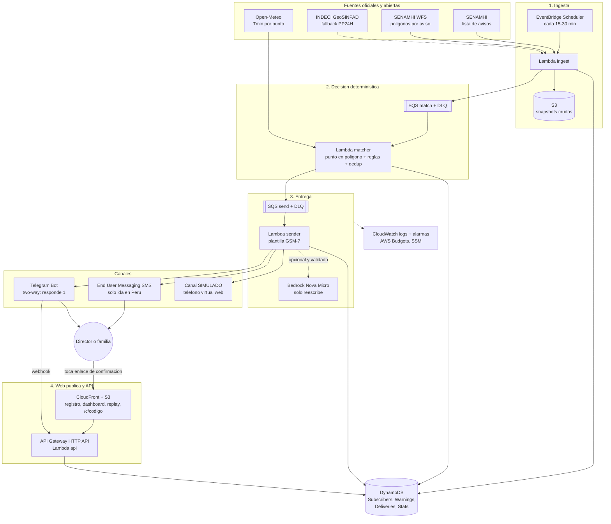
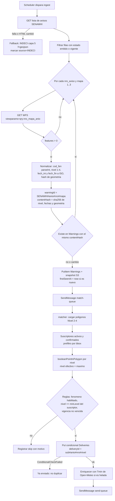
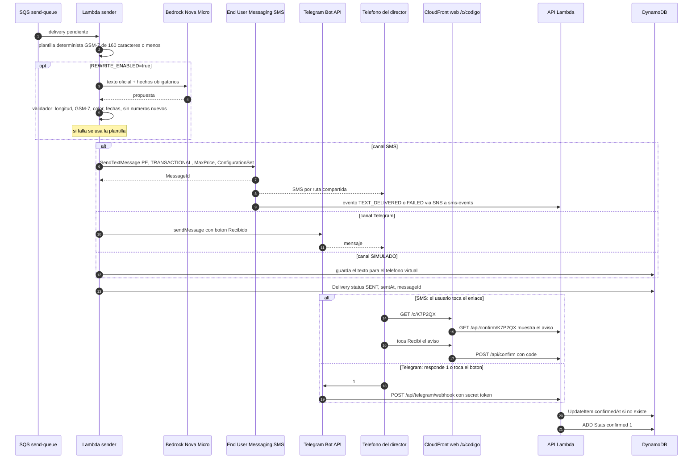
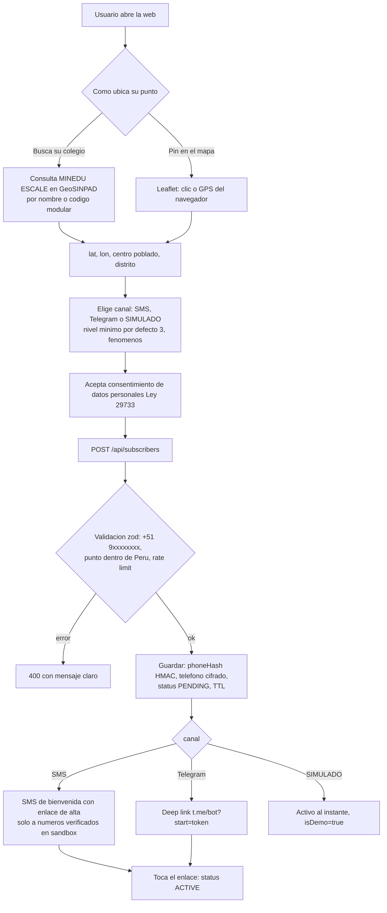
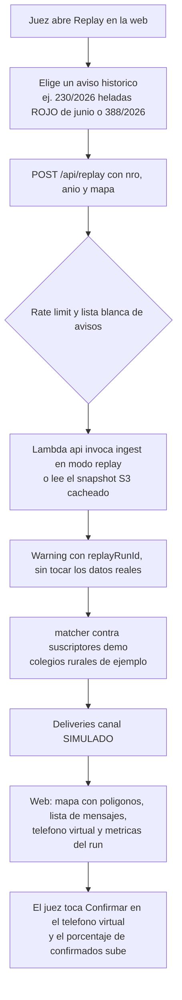
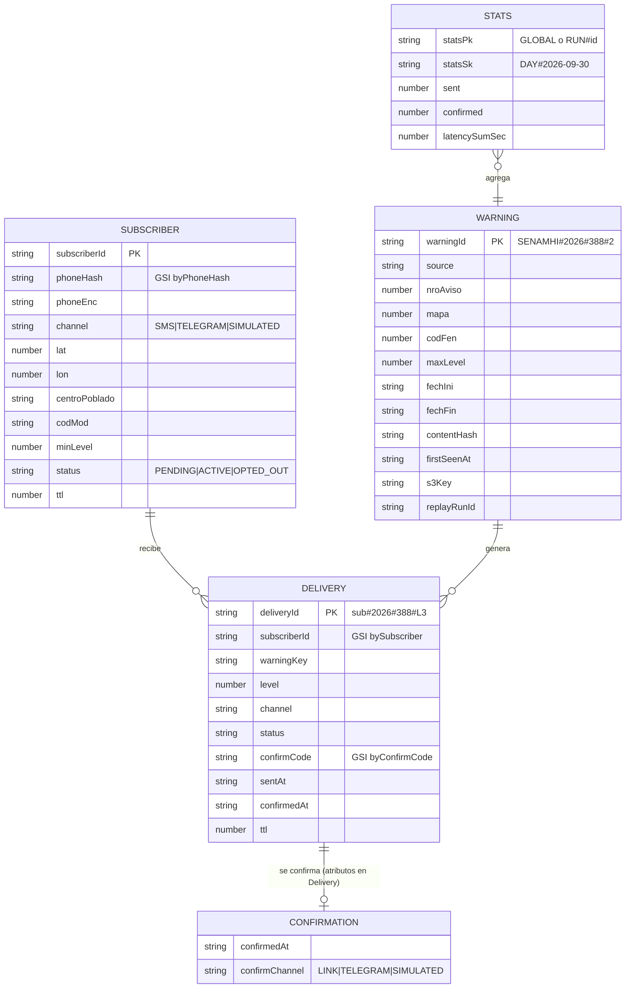

# Arquitectura: Aviso Andino

> Principio rector: **ninguna IA decide quién recibe una alerta ni cuándo.** Eso lo deciden solo los avisos oficiales de SENAMHI y reglas deterministas con tests (ver `RULES.md`). Bedrock, si está activo, solo *reescribe* un texto que ya fue decidido, y su salida pasa por un validador que la descarta si inventa algo.

Imagen del diagrama principal: `docs/architecture.png` (fuente: `docs/architecture.mmd`).

## (a) Arquitectura del sistema

**Componentes (una sola stack CDK en `us-east-1`):**

| Componente | Servicio | Responsabilidad |
|---|---|---|
| `ingest` | Lambda (Node 24, arm64, 512 MB, 60 s) + EventBridge Scheduler (`rate(15 minutes)`, configurable) | Lee la lista de SENAMHI, detecta avisos nuevos o cambiados, descarga sus polígonos por WFS, normaliza, guarda un snapshot en S3 y el `Warning` en DynamoDB, y encola en `match-queue`. Fallback: INDECI capa 5. |
| `matcher` | Lambda (SQS `match-queue`, batch 1) | Para cada `Warning`: busca suscriptores candidatos (prefiltro bbox), aplica punto en polígono (Turf), reglas de nivel, fenómeno y horario, y dedup condicional. Crea `Delivery` y encola en `send-queue`. Enriquece con la Tmin de Open-Meteo (cacheada). |
| `sender` | Lambda (SQS `send-queue`, reserved concurrency 2) | Arma el mensaje con la plantilla GSM-7 (≤160). Opcional: reescritura con Bedrock + validador. Envía por SMS (End User Messaging), Telegram o SIMULADO y actualiza `Delivery`. |
| `sms-events` | Lambda (SNS desde el Configuration Set de End User Messaging) | Guarda los estados de entrega (`TEXT_DELIVERED`, `TEXT_UNREACHABLE`, `TEXT_CARRIER_BLOCKED`…) en `Delivery`. |
| `api` | API Gateway HTTP API + Lambda | `POST /subscribers`, `POST /confirm`, `GET /alerts`, `GET /metrics`, `POST /replay`, `POST /telegram/webhook`, `DELETE /subscribers/{id}` (baja). |
| web | S3 (privado, OAC) + CloudFront | SPA Vite+React+Leaflet: registro, dashboard, replay, página de confirmación `/c/:code`. CloudFront enruta `/api/*` al HTTP API (mismo dominio, sin CORS y con enlaces cortos). |
| datos | DynamoDB on-demand (4 tablas), S3 (snapshots, lifecycle de 30 días) | Ver `DATA_MODEL.md`. |
| operación | CloudWatch Logs (JSON), alarmas, AWS Budgets, SSM Parameter Store | Ver buenas prácticas. |

## (b) Flujo de ingesta y matching

## (c) Entrega y confirmación

## (d) Registro

## (e) Replay y demo

## (f) Modelo de datos (ER)

## Buenas prácticas AWS aplicadas (Well-Architected)

**Seguridad**
- **IAM de mínimo privilegio por Lambda**: `ingest` solo `PutItem/GetItem` en Warnings, `s3:PutObject` en su prefijo y `sqs:SendMessage` a match-queue. `matcher` lee Subscribers y Warnings y escribe Deliveries. `sender` puede `sms-voice:SendTextMessage` (limitado al ARN del configuration set), `bedrock:InvokeModel` (solo el perfil de Nova Micro y sus foundation-model) y `ssm:GetParameter` sobre `/aviso-andino/*`. `api` solo las acciones que necesita. Se usan los `grant*` de CDK, nunca `*`.
- **Secretos**: token del bot de Telegram, secreto del webhook y clave HMAC de teléfonos en **SSM Parameter Store SecureString** (gratis en tier estándar) o Secrets Manager (USD 0,40/secreto/mes). Nunca en el código ni en `cdk.json`. Se leen en el cold start y se cachean.
- **Privacidad de teléfonos** (Ley 29733 de Protección de Datos Personales):
  - `phoneHash = HMAC-SHA256(E.164, secreto)` para buscar y deduplicar. `phoneEnc` cifrado con KMS (CMK, ~USD 1/mes) o, si se decide no pagar la CMK, cifrado en reposo de DynamoDB y minimización.
  - Logs **enmascarados** (`+51 9•••••123`). La API pública nunca devuelve teléfonos.
  - **TTL**: suscriptores demo 14 días; reales 180 días desde la última confirmación, con aviso de renovación. Deliveries 30 días (las métricas agregadas quedan en Stats).
  - **Baja** en un clic con enlace (`/b/:code`), `/baja` en Telegram y `DELETE /subscribers/{id}`. STOP por SMS **no** es posible en Perú sin short code (ver RESEARCH.md §3); se documenta como limitación.
  - Consentimiento explícito (checkbox) con texto de finalidad y conservación.
- Webhook de Telegram validado con el header `X-Telegram-Bot-Api-Secret-Token`. S3 privado con OAC. HTTPS obligatorio. HTTP API con throttling (p. ej. 5 rps, burst 10) y `POST /replay` limitado a una lista blanca de avisos y solo canal SIMULADO.

**Fiabilidad**
- **Idempotencia**: `deliveryId` determinista + `PutItem` con `attribute_not_exists(deliveryId)`, así el mismo aviso nunca manda dos SMS al mismo suscriptor aunque SQS reentregue o ingest corra dos veces. El `sender` pasa `PENDING → SENDING` con una condición antes de llamar a la API de SMS (o usa Powertools Idempotency).
- **SQS con DLQ** (`maxReceiveCount: 3`), `reportBatchItemFailures` y alarma si la DLQ tiene más de 0 mensajes. Reintentos con backoff exponencial y jitter en las llamadas HTTP a SENAMHI/INDECI (timeout de 10 s).
- **Degradación**: si el WFS falla → INDECI. Si Bedrock falla o tarda más de 3 s → plantilla. Si Open-Meteo falla → plantilla sin Tmin. Si el HTML de la lista cambia → alarma "0 avisos parseados durante 6 h" + fallback INDECI.
- Snapshots crudos en S3 (auditoría y replay reproducible).

**Excelencia operativa**
- Logs JSON estructurados (Powertools Logger) con `warningId`, `deliveryId`, `subscriberId` y `correlationId`. Métricas EMF: `WarningsIngested`, `DeliveriesSent`, `DeliveriesFailed`, `RewriteFallback`, `LatencyDetectToSendSec`.
- **Alarmas CloudWatch** (10 gratis): errores de cada Lambda, DLQ > 0, `ingest` sin éxito en 1 h, `DeliveriesFailed` > 3/h y gasto SMS (métrica de End User Messaging, si existe; si no, contador propio × 0,23252).
- **AWS Budgets**: presupuesto mensual de USD 10 con alertas al 50 %, 80 % y 100 % por email (2 budgets gratis).
- X-Ray: **opcional** (`tracing: Active` en las Lambdas con un flag; el free tier incluye 100k trazas/mes).

**Costo**
- Todo serverless y on-demand. Lambdas arm64. EventBridge Scheduler (no un cron Lambda que se quede esperando). DynamoDB on-demand. CloudFront en lugar de un servidor. Sondeo configurable.
- **Límites de SMS por diseño**: gasto mensual de la cuenta (sandbox USD 1, subir a ~10–20), `MaxPrice` por mensaje, Protect Configuration que solo permite PE, tope de SMS por día y por suscriptor (máx. 3) y tope global diario (p. ej. 30). Al alcanzarlo se degrada a SIMULADO/Telegram y se registra.
- Bedrock: Nova Micro, `maxTokens` 120, solo si `REWRITE_ENABLED=true`, con caché por `warningId+plantilla` (misma reescritura para todos los suscriptores de un aviso, cambiando solo el lugar y el enlace).
- Open-Meteo: una llamada con varios puntos por lote, caché de 3 h por celda de 0,1° (muy por debajo de 10k/día).

**Región: `us-east-1` vs `sa-east-1`**

| | us-east-1 (elegida) | sa-east-1 (São Paulo) |
|---|---|---|
| Latencia a Lima | ~100–130 ms (irrelevante para un proceso batch y un SMS) | ~60–80 ms |
| Bedrock Nova Micro | Sí (perfil `us.`) | **[NO VERIFICADO]**; probablemente solo vía perfil cross-region |
| End User Messaging SMS | Sí | Sí **[verificar]** |
| Endpoint del AWS MCP Server | `aws-mcp.us-east-1.api.aws` | – |
| Precio | Más barato en general | ~20–50 % más caro en varios servicios |
| Residencia de datos | Fuera de Sudamérica | Más cerca (la Ley 29733 permite el flujo transfronterizo con garantías) |

Decisión: **us-east-1** por Bedrock, por el ecosistema del hackathon y por costo. Para producción con el Estado peruano convendría reevaluar sa-east-1.
